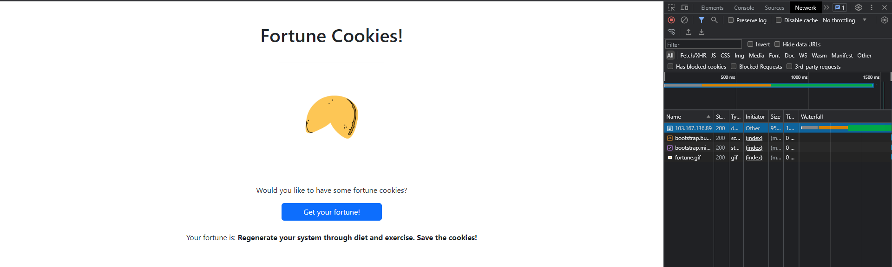
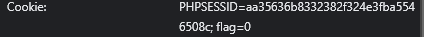
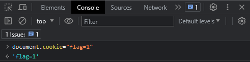

# Fortune Cookies

Would you like to have some fortune cookies?
(Kalian suka cookies gak?)

## About The Challenge

Oke pada webiste dibuka disuguhkan dengan tampilan seperti itu. Disana terdapat tombol "Get your fortune!" jika diklik akan menghasilkan kata-kata

### Solution

Saya membuka **inspect element** kemudian masuk ke tab network. Saat tab tersebut terbuka saya klik tombol "Get your fortune!" untuk melihat request yang dihasilkan tombol tersebut

Kemudian saya melihat isi dari cookies tersebut

Disana terdapat tulisan **flag=0** yang kemudian saya ganti ke **flag=1** dengan cara saya ke **tab console**. Kemudian saya ketik
`document.cookie = "flag=1"`

Setelah itu saya klik kembali tombol "Get your fortune!" dan menghasilkan flag yang dicari.
`ForestyHC{here_is_your_fortun3_cookie_4a0a47}`
